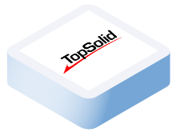

<h1 align="center">
  <br/>
  Speckle connector for TopSolid
</h1>
<h3 align="center">
   Speckle is an open source data platform for interoperability in AEC.
</h3>
<br>
<p align="center">
<a href="https://speckle.community"></a> 
<a href="https://speckle.systems"></a> <a href="https://speckle.guide/dev/"></a>

</p>


<br><br>

# About the connector for TopSolid

What is TopSolid Connector ? :popcorn:  
[Check our videos on YouTube](https://www.youtube.com/@hackingbim4954)


<br>

TopSolid is a CAD-CAM software that allows a continuous workflow from Design to Manufacturing [TopSolid](https://www.topsolid.fr/)
should be installed with a valid license.


The source code is available in the following repo :
[ENAC-CNPA/speckle-sharp](https://github.com/ENAC-CNPA/speckle-sharp)


Note : Work is still under progress


<br>

---

<br>
<div align="center">
    
</div>

## User Setup

1. Download the setup file : 
  - 7.16 : [Binaries/Speckle_ConnectorTopSolid_v7.16.zip](https://github.com/ENAC-CNPA/Speckle.TopSolid/raw/main/Binaries/Speckle_ConnectorTopSolid_v7.16.zip)
  - 7.17 : [Binaries/Speckle_ConnectorTopSolid_v7.17.zip](https://github.com/ENAC-CNPA/Speckle.TopSolid/raw/main/Binaries/Speckle_ConnectorTopSolid_v7.17.zip)
  
2. Open the zip file and launch the installation (administrator rights are required)


<br>

---

<br>

## Development Setup


1. Clone the repo in "C:\Sources\" : 

     `git clone https://github.com/ENAC-CNPA/speckle-sharp.git`

     Result output folder :
```
   C:\Sources\speckle-sharp
```

2. Open the solution in Visual Studio 2022+ (for 7.1(X) : your TopSolid version) : `C:\Sources\speckle-sharp\ConnectorTopSolid\ConnectorTopSolid71X\ConnectorTopSolid.sln`

3. Check the TopSolid Dev folder is in : `C:\Sources\Topsolid 7.1X\Debug x64` **

    ** The debug files are provided by the TopSolid ads team : [ads.topsolid.com](https://ads.topsolid.com)


<br>

---

<br>


## License
Unless otherwise described, the code in this repository is licensed under the Apache-2.0 License. Please note that some modules, extensions or code herein might be otherwise licensed. This is indicated either in the root of the containing folder under a different license file, or in the respective file's header. If you have any questions, don't hesitate to get in touch with us via email.


## Contact us
We are available for all questions and suggestions !

[CNPA Labs](https://www.epfl.ch/labs/cnpa/)